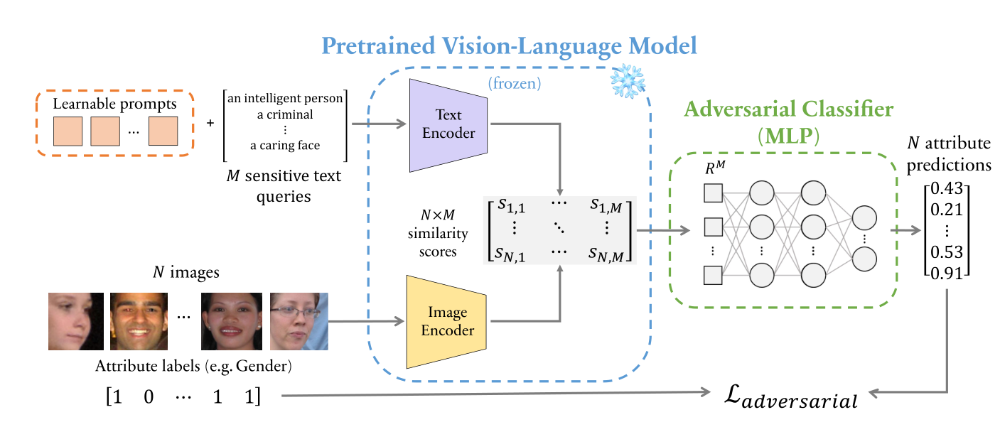

# A Prompt Array Keeps the Bias Away: Debiasing Vision-Language Models with Adversarial Learning

Authors: [Hugo Berg](https://github.com/Drummersbrother), 
[Siobhan Mackenzie Hall](https://github.com/smhall97), 
[Yash Bhalgat](https://github.com/yashbhalgat), 
[Wonsuk Yang](https://github.com/WonsukYang), 
[Hannah Rose Kirk](https://github.com/HannahKirk), 
[Aleksandar Shtedritski](https://github.com/suny-sht), 
[Max Bain](https://github.com/m-bain)

Corresponding author: Hugo Berg, <hugo@hugob.se>




## Background

Large-scale, pretrained vision-language models are growing in popularity due to their impressive 
performance on downstream tasks with minimal additional training data. The risk and type of 
societal harm intimately interacts with the downstream task at hand. 

In our work, we build on prior bias measurements, namely an adaptation of WEAT, harmful image 
misclassifications, and ranking metrics. Our aim is to demonstrate a debiasing protocol which 
does not assume access to the original training data, nor the resources to retrain from scratch. 
Thus, we focus our efforts on fine-tuning, prompting and debiasing protocols with low 
computational cost.

## Datasets used

**[FairFace](https://arxiv.org/abs/1908.04913)**:
 - Consists of 108 501 images of GAN-generated faces with an emphasis on a balanced composition by 
 age, gender and ethnicity. 
 - Seven ethnicities included: White, Black, Indian, East Asian, South East Asian, Middle East and Latino. 
 - The training dataset for the utilized GAN was collected from the 
 [YFCC-100M Flickr dataset](https://arxiv.org/abs/1503.01817).

**[UTKFace Cropped image dataset](https://github.com/aicip/UTKFace)**:
- Contains 20 000 images and includes four distinct ethnicities: White, Black, Asian, Indian, 
 and Others (like Hispanic, Latino, Middle Eastern). 
- This is a notable limitation compared to FairFace which has individual classes for each of these. 
- UTKFace is also very different to the qualitative characteristics of FairFace, in terms of 
 large variance in lighting conditions, color quality and angle of portraits. 

## Models
- OpenAI's CLIP ([Radford *et al*., 2021](https://arxiv.org/abs/2103.00020))
- SLIP ([Mu *et al*., 2021](https://arxiv.org/abs/2112.12750))
- Frozen in Time ([Bain *et al*., 2021](https://arxiv.org/abs/2104.00650))

[Load trained models](https://github.com/oxai/bias-vision-language/blob/debias-vision-lang/loading_trained_embeddings.ipynb)

## Bias Measurement
#### [MaxSkew](https://arxiv.org/abs/1905.01989)
Measures the difference between the desired proportion of image attributes in a sensitive text 
query and the actual proportion. For example, given the text query “this person has a degree in 
mathematics”, a desired distribution of the image attribute gender could be 50% to ensure equal representation.

#### [Normalized Discounted Cumulative KL-Divergence (NDKL)](https://arxiv.org/abs/1905.01989)
Employs a ranking bias measure based on the Kullback-Leibler divergence, measuring how much one 
distribution differs from another. This measure is non-negative, with larger values indicating a 
greater divergence between the desired and actual distributions of attribute labels.


## Debiasing with Adversarial Learning
(see figure above)

Sensitive text queries and images (with labeled attributes, e.g. Gender) are fed to their 
respective frozen text and image encoders. We employ an adversarial classifier which aims to 
predict the image attribute labels from similarity scores between the outputs of the two 
encoders. Learnable “debiasing” prompt tokens are prepended to the sensitive text queries and 
optimized to maximize the error of the adversary. In this way, biased correlations between 
text-image similarity scores and attribute labels are reduced whilst preventing significant 
feature degradation.

## Implement your own debiasing
```bash
$ pipenv sync --three
$ ./datasets/download_all_datasets.sh
$ ipython debiasing_experiments.ipynb
$ ipython ranking_experiments.ipynb # works with pretrained models prior to debiasing
$ ipython test_models.ipynb # works with trained models post debiasing
$ ipython metrics_plotting.ipynb
```

## Licence
Our code is licensed under the MIT licence. Read [LICENCE.txt](LICENCE.txt) for more.

## Citation
```
@article{berg2022prompt,
  title={A Prompt Array Keeps the Bias Away: Debiasing Vision-Language Models with Adversarial Learning},
  author={Berg, Hugo and Hall, Siobhan Mackenzie and Bhalgat, Yash and Yang, Wonsuk and Kirk, Hannah Rose and Shtedritski, Aleksandar and Bain, Max},
  journal={arXiv preprint arXiv:2203.11933},
  year={2022}
}
```
